# Berserk Archive

Berserk Archive — *The Manga Archive* — is a fan-made encyclopedia of Kentaro Miura's Berserk, designed as an interactive manga volume: chapter tabs, panels, gutters, folios, marginalia and ink. Every claim carries a canon classification and sources; spoilers are hidden by default.

### Sections

Cover with page-split entry · Archive index (16 chapters) · Character database & dossiers with development strips · Relationship map · Factions · Apostle database with interactive transformation · God Hand chamber · Weapons arsenal (blueprint plates) · Horizontal chronology & cinematic event views · Lore manuscript · Hand-drawn atlas · Manga craft essay · Interactive panel analysis · Shot-type cinematography · Anime archive · Manga vs anime comparison · Music · Volume shelf · Global search · Bibliography.

### Artwork

Every drawing is an original fan illustration built in code with seinen-manga technique: cross-hatching, screentone, rim light, focus and speed lines, hand-lettered katakana sound effects and speech balloons. No Berserk panels or official illustrations are included.

To use real images you own or have permission to publish, drop them into [`frontend/src/assets/panels/`](frontend/src/assets/panels/) named after their slot (e.g. `guts.jpg`) — no code to edit. [`SLOTS.md`](frontend/src/assets/panels/SLOTS.md) lists every slot and which are filled; open the repo in VS Code and use **Run Task… → Panels: update image checklist** to refresh it. Full steps: [`frontend/src/assets/panels/README.md`](frontend/src/assets/panels/README.md).

## See it

**Live site:** once this repository's GitHub Pages is enabled (see *Deploy* below), the site is published at
`https://atulswain.github.io/BerserkFanMadeClub/` on every push to `main`.

| Cover | Archive index |
|---|---|
| 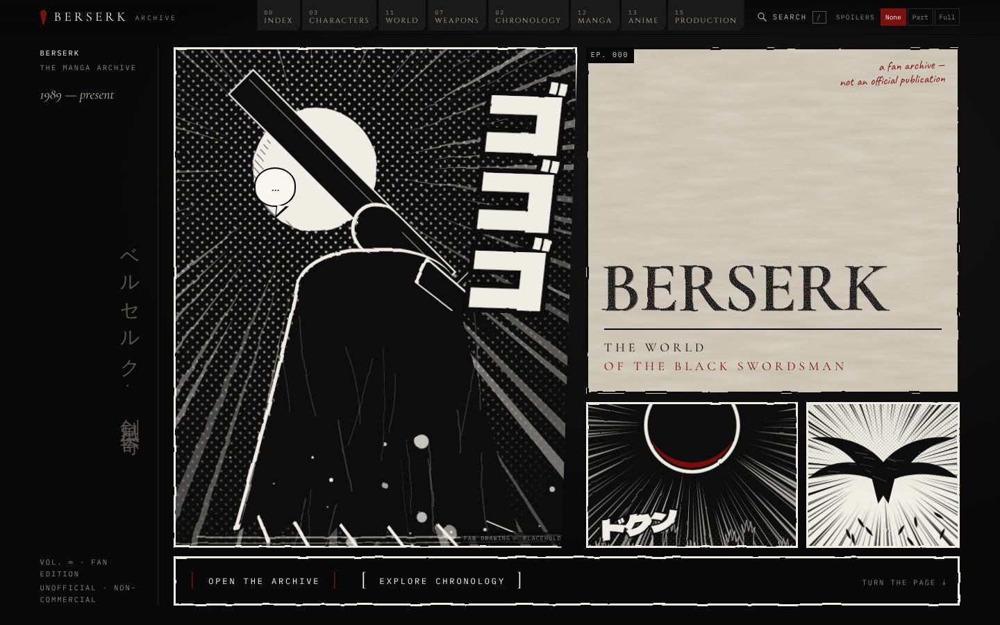 | 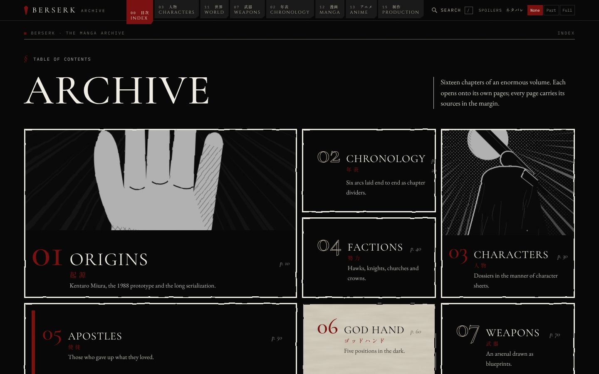 |
| **Character dossier** | **Relationship map** |
| 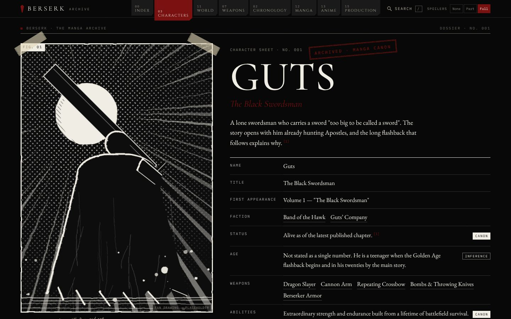 | 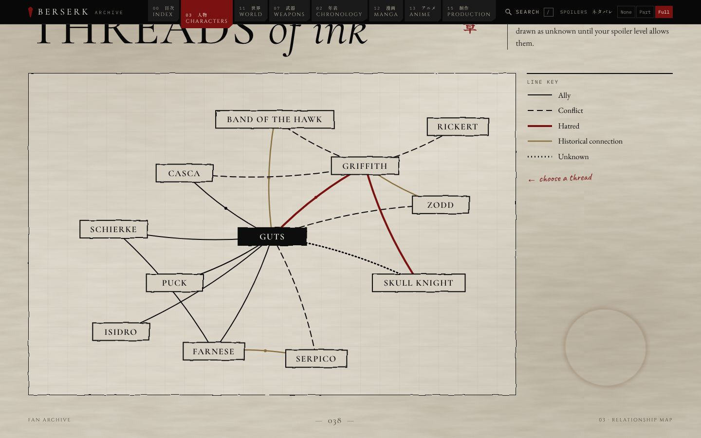 |
| **God Hand** | **Weapons arsenal** |
| 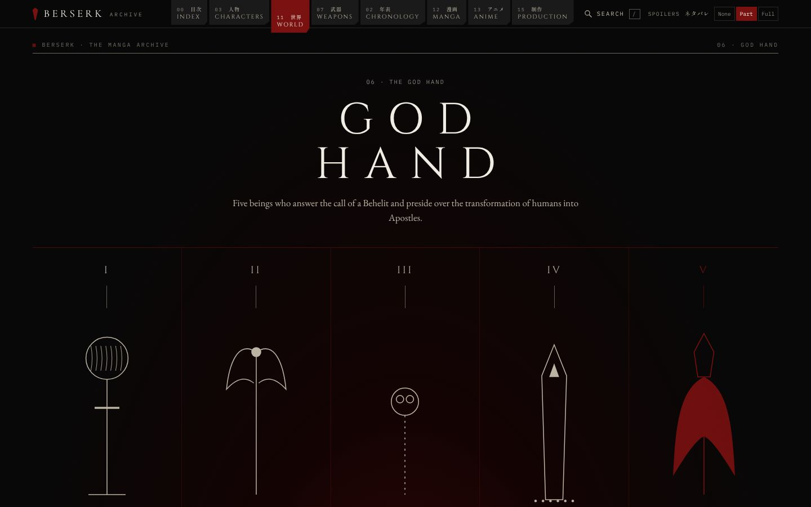 | 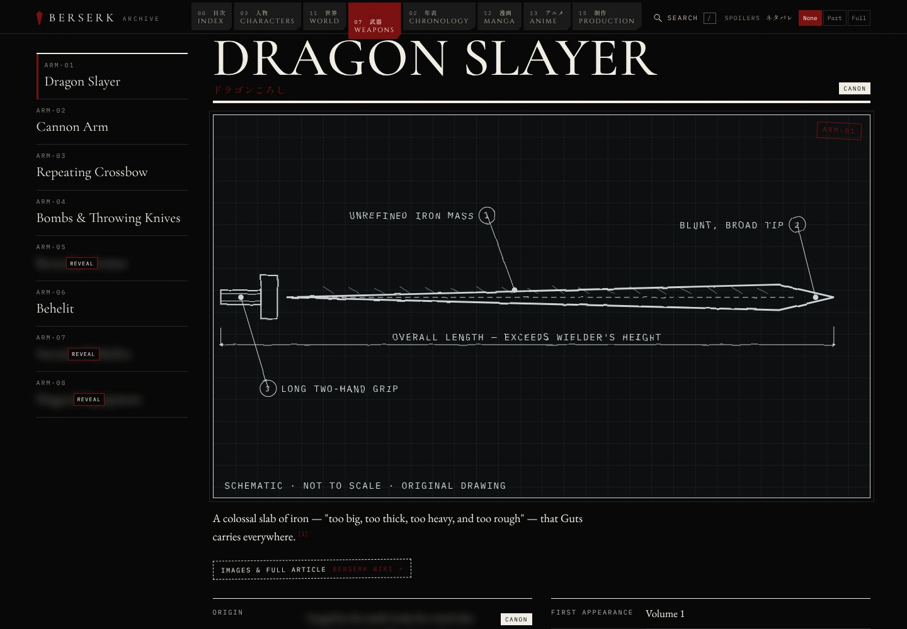 |
| **Chronology** | **Event view — The Eclipse** |
| 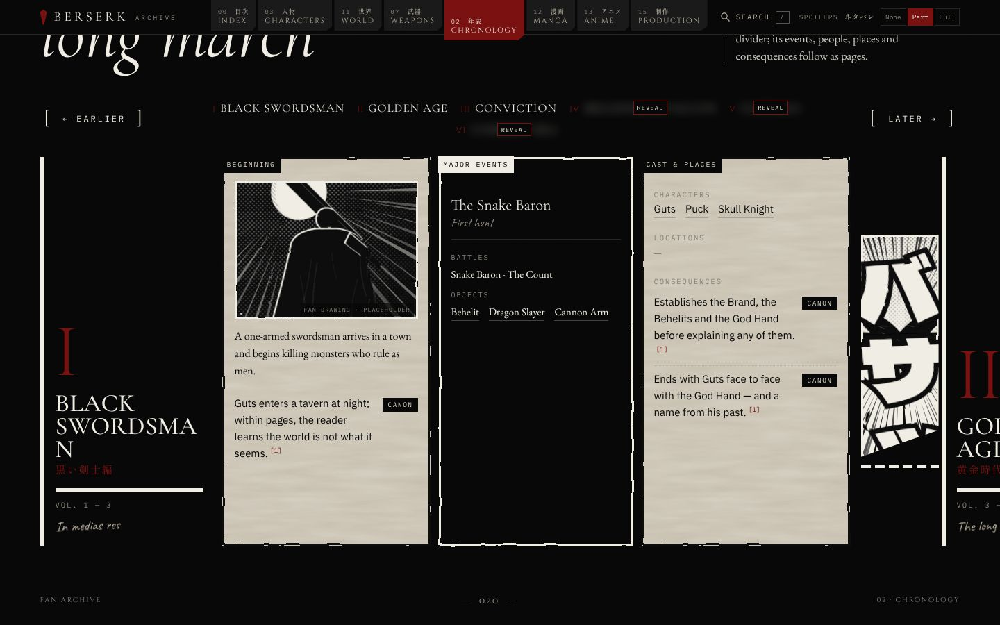 | 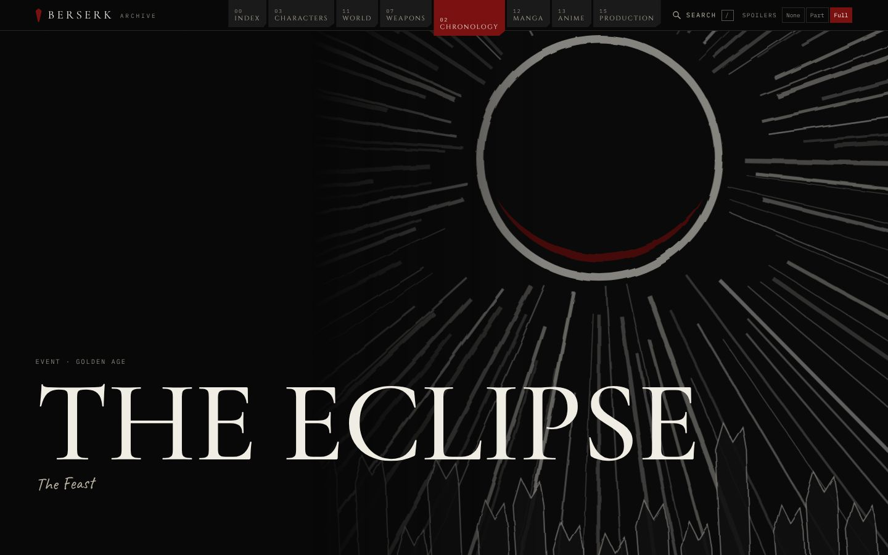 |
| **Atlas** | **Panel analysis lab** |
| 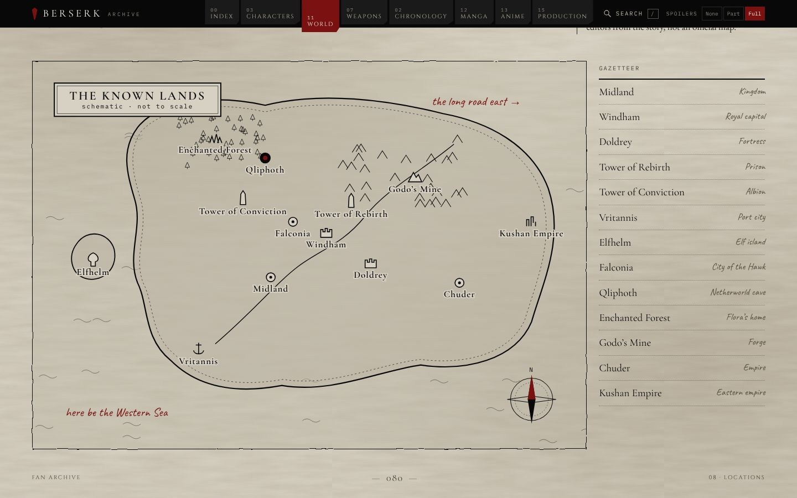 | 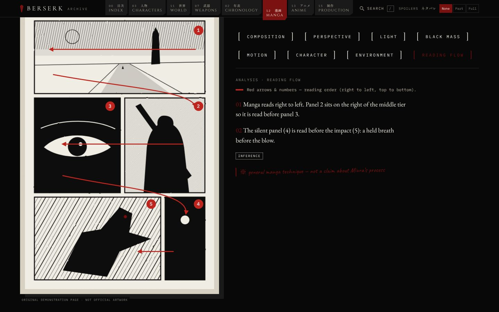 |

<p>
  
  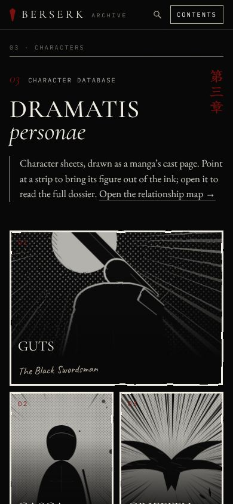
</p>

## Technology Stack

- Frontend: React, TypeScript, Vite, React Router DOM, hand-written CSS (no UI or animation libraries — CSS animations, SVG filters and IntersectionObserver keep it fast)
- Backend: Python, FastAPI, SQLAlchemy, Alembic, PostgreSQL, Pydantic
- Planned integrations: JWT authentication, Cloudinary, Meilisearch, Redis, Docker, analytics, localization, and cloud deployment

## Folder Structure

```text
backend/            FastAPI read API + unmounted admin API
database/schema.sql PostgreSQL schema (entities, claims, sources, links)
docs/CMS.md         data model, source system and CMS notes
frontend/src/
  art/              original placeholder art, blueprints, demo manga page
  components/       page frame, panels, spoilers, canon stamps, nav, search
  data/             typed seed content + ArchiveRepository
  cms/              admin field definitions (not routed)
  pages/            one lazy-loaded chunk per section
  styles/           tokens, base, system, chrome, pages
```

## Installation

### Frontend

```bash
cd frontend
npm install
npm run dev
```

### Backend

```bash
cd backend
python -m venv venv
venv\Scripts\activate
pip install -r requirements.txt
uvicorn app.main:app --reload
```

## Development Commands

- `npm run dev` starts the frontend development server.
- `npm run build` type-checks and builds the frontend.
- `uvicorn app.main:app --reload` starts the backend API.

## Deploy

The site is a static build and deploys to **GitHub Pages** with `.github/workflows/pages.yml`:

1. In the repository go to **Settings → Pages → Build and deployment** and set **Source** to **GitHub Actions**.
2. Merge to `main` (or run the *Deploy site to GitHub Pages* workflow manually from the **Actions** tab).
3. The site appears at `https://<owner>.github.io/<repository>/`.

Build variants:

- `npm run build` — normal build served from `/`.
- `BASE_PATH=/BerserkFanMadeClub/ npm run build:pages` — GitHub Pages build (sub-path + `404.html` fallback so deep links work).
- `npm run build:preview` — hash-routed build with relative paths that runs from any folder or static host.

`.github/workflows/ci.yml` builds the frontend and checks the backend on every pull request.

## Future Roadmap

- Authentication and user profiles
- Admin dashboard
- Discussion forums and community features
- Bookmarks, favorites, reviews, and achievements
- Image uploads, search, caching, and real-time chat
- Dark mode, localization, SEO, analytics, Docker, and cloud deployment

## Contribution Guide

Keep changes small, typed, documented, and aligned with the existing folder boundaries. Prefer reusable components, service modules, and backend business logic separated from route definitions.

## License

This is a fan-made project and is not affiliated with, endorsed by, or sponsored by the owners of Berserk. Project code is intended for educational and non-commercial use.

